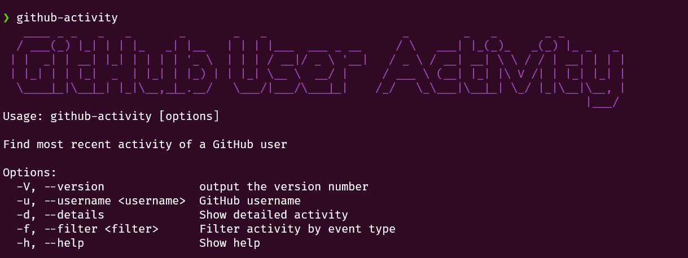

# GitHub User Activity CLI

A command-line interface (CLI) tool to find the most recent activity of a GitHub user.

Project page url: https://roadmap.sh/projects/github-user-activity

## Preview



## Table of Contents

---

- [Installation](#installation)
- [Usage](#usage)
- [Options](#options)
- [Examples](#examples)

## Installation

---

To install the GitHub User Activity CLI, first clone this github repository:

```bash
git clone https://github.com/Rahul8320/Github-User-Activity-Cli.git
```

Then move to the `Github-User-Activity-Cli` directory and run the following command:

```bash
npm install
```

Then build this tool and install globally in your system using the following command:

```bash
npm run build
npm install -g .
```

This will install the CLI tool globally on your system.

## Usage

---

To use the GitHub User Activity CLI, run the following command:

```bash
github-activity -u <username>
```

Replace `<username>` with the actual GitHub username you want to retrieve activity for.

## Options

---

- `-u, --username <username>`: Specify the GitHub username to retrieve activity for. (required)

- `-d, --details`: Show detailed activity.

- `-f, --filter <filter>`: Filter activity by event type.

- `-h, --help`: Display this help message.

- `-V, --version`: Display the version number.

## Examples

---

- Retrieve activity for the GitHub user `rahul8320`:

```bash
github-activity -u rahul8320
```

This will display the most recent activity for the user `rahul8320` on GitHub.

- Retrieve detailed activity for the GitHub user `rahul8320`:

```bash
github-activity -u rahul8320 -d
```

This will display the detailed activity for the user `rahul8320` on GitHub.

- Filter activity by event type for the GitHub user `rahul8320`:

```bash
github-activity -u rahul8320 -f PushEvent
```

This will display only push events for the user `rahul8320` on GitHub.

## Contributing

---

Contributions are welcome! If you'd like to contribute to this project, please fork the repository and submit a pull request with your changes.

## License

---

This project is licensed under the ISC License.

## Author

---

[Rahul Dey](https://github.com/rahul8320)
